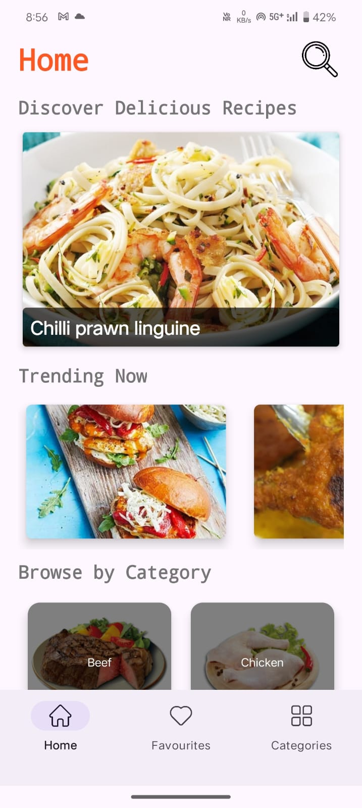
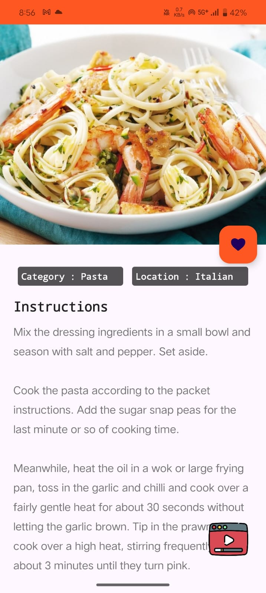
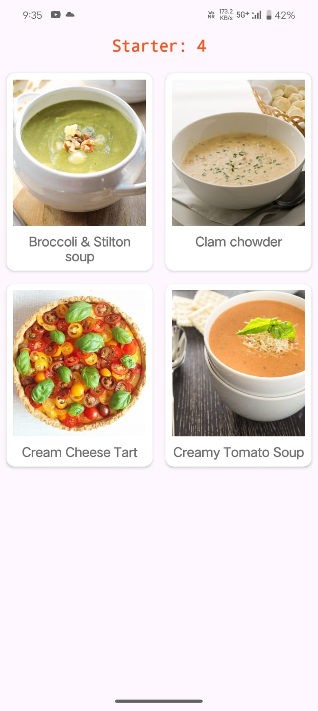
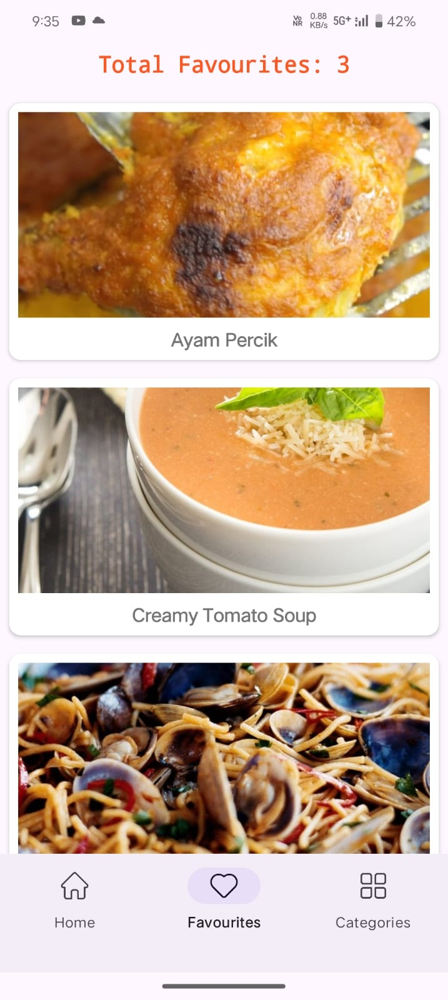
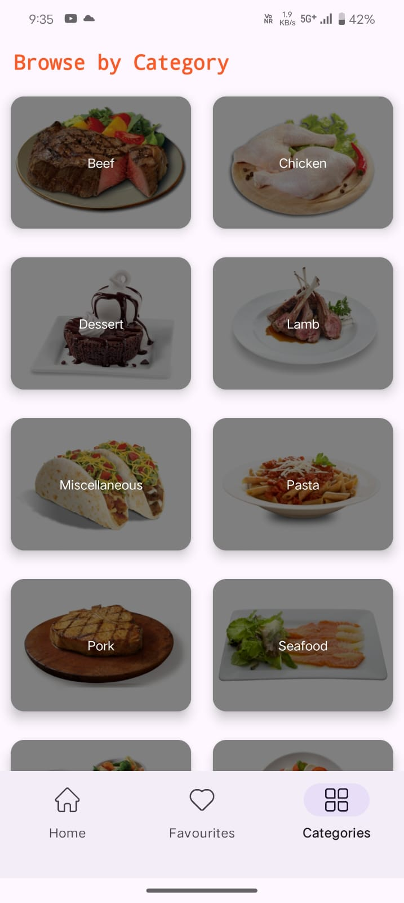

# Recipe App in Kotlin

I’m excited to share my latest Android project—**a Recipe App** built in Kotlin! This app allows users to explore, save, and view their favorite recipes. Some of the key features include:

- 🍴 **Recipe Search**: Fetches recipes based on categories, random selections, and more.
- 💾 **Favorite Recipes**: Stores user’s favorite recipes using **Room Database**.
- 🧑‍🍳 **MVVM Architecture**: Clean architecture for better separation of concerns and maintainability.
- 🔌 **Retrofit Integration**: Fetches recipes data from an external API with ease.
- 📱 **Modern UI/UX**: Simple and intuitive interface for seamless user experience.

This project helped me enhance my skills in Android development while learning about **MVVM architecture**, **Retrofit**, and **Room Database**.

## Screenshots of the App

Here’s a glimpse of the app’s interface across various screens:

### **Home, Recipe Details, and Category Screens**
| **Home Screen** | **Recipe Details Screen** | **Category Recipes Screen** |
|-----------------|---------------------------|-----------------------------|
|  |  |  |

### **Favorite Recipes and Category Screens**
| **Favorite Recipes Screen** | **Category Screen** |
|-----------------------------|--------------------|
|  |  |

## Features

- **Recipe Search**: Allows users to search and browse recipes based on different categories or random selections.
- **Favorite Recipes**: Users can save their favorite recipes using **Room Database**, which persists data locally.
- **MVVM Architecture**: Implements **Model-View-ViewModel** architecture for clean and maintainable code.
- **Retrofit API Integration**: Fetches data from a remote API for real-time recipe updates.
- **User-friendly UI**: The app features an intuitive interface for smooth navigation and seamless interaction.

## Libraries and Tools Used:
- **Kotlin** for Android development
- **MVVM Architecture** for better code organization
- **Retrofit** for API integration
- **Room Database** for local storage
- **Glide** for image loading
